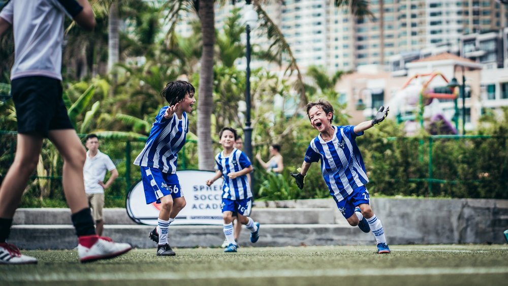

<section class="banner fullscreen style5 invert orient-center content-align-center onscroll-image-fade-in">
  <!-- slider -->
  

    <!-- Additional required wrapper -->
    

        <!-- Slides -->
      

      

      

      

      

    

    <!-- Add Pagination -->
    

    <!-- Add Arrows -->
    

    

  

</section>

